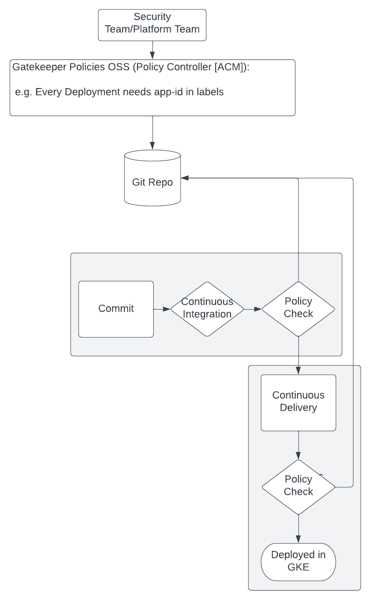
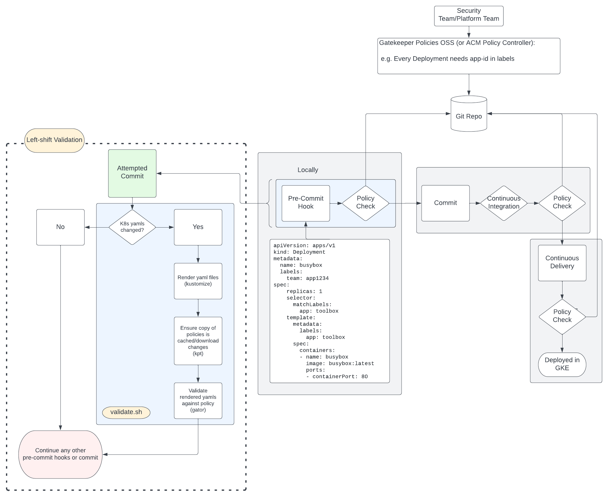
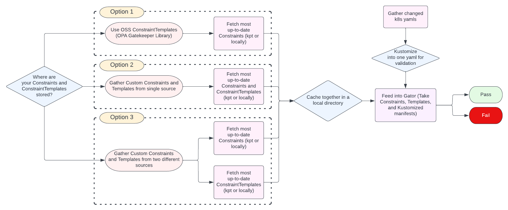

# Left-Shift Validation at Pre-Commit Hook

This pre-commit hook uses open-source tools to provide developers with a way to validate Kubernetes manifests before changes are committed and pushed to a repository.

Policy checks are typically instantiated after code is pushed to the repository, as it goes through each environment (dev, QA, production, etc.), and right before administration to the cluster. The goal with this script is to validate at the pre-commit hook stage, applying your security and policy check even earlier (shifting left) than usual.

Using left-shift validate means you learn *if your deployments are going to fail* on the order of seconds as it happens right before committing, rather than minutes or hours after it has already undergone multiple parts, or even most, of your CI/CD pipeline.

While these scripts were first designed to work in environemnts using Kustomize, they've been adapted to work for whatever file organization structure you provide. `validate.sh` uses git diff to find any and all staged yaml files, and then will validate each against the Constraints and ConstraintTemplates you provide.

---

## Setting Up left-shift validation

Using left-shift validation is simple!

### Initial installation

1. From this repository, you only need the following items:

- `validate.sh`
- `setup.sh`
- `constraints-and-templates/` directory

    *If you don't want to clone the whole project, you can use `wget` to download the specific files. For example:*

    `wget https://raw.githubusercontent.com/GoogleCloudPlatform/professional-services/main/examples/left-shift-validation-pre-commit-hook/validate.sh`

2. Place these items into the same directory as your `.git` folder. `setup.sh` will move `validate.sh` into your hooks from there.

3. Make both files executable, which can be accomplished by:

    `$ chmod +x setup.sh && chmod +x validate.sh`

4. After this step, run `setup.sh`

    `$ ./setup.sh`

5. Answer the prompts, and then you're done!

Now, whenever you go to commit code and updated Kubernetes yaml files are found, the pre-commit hook will test your changes against the policy constraints you've specified. Nifty!

**After initial installation:**

`setup.sh` is primarily for dependency installations and contains a guided walkthrough of obtaining the locations of your Constraint and ConstraintTemplates. If your policy constraints change, you can run this script again, which will automatically update dependencies as well.

The locations you specify for your Constraints, ConstraintTemplates, and (if using Kustomize) base Kustomization folder will be written into a settings file in `.oss_dependencies` for `validate.sh` (pre-commit hook) to use. You can directly change these variables as necessary without having to run `setup.sh`. The pre-commit hook will run every time you attempt a commit!

---

## Technical Overview

Left-shift validation is intended to run as a pre-commit hook, so it has been designed with two distinct Bash scripts, `setup.sh` and `validate.sh`. **Here's what they do:**

### setup.sh

1. Install or update dependencies.
2. Turn `validate.sh` into a pre commit hook.
3. Determine the locations of Constraints/ConstraintTemplates to use, then save the path/remote repository URL to `.env`.

### validate.sh (Pre-commit Hook)

1. When `git commit` runs, check if any yaml files have been updated.
2. (If you're using Kustomize) Run `kustomize` to build a unified yaml file for evaluation.
3. Gather the Constraints and ConstraintTemplates and save them to a local folder. Use `kpt` if from a remote repo.
4. Run `gator test`, which validates the unified yaml file against the policies (Constraints and ConstraintTemplates).
5. Fail the commit if violations are found. If there are no errors, continue the commit.

---

## Purpose

Organizations that deploy applications on Kubernetes clusters often use tools like [Open Policy Agent](https://www.openpolicyagent.org/) (OPA) or [Gatekeeper](https://open-policy-agent.github.io/gatekeeper/website/docs) to enforce security and operational policies. These are often essential for a company to meet legal or business requirements, but they have the added benefit of empowering their developers by providing consistent feedback on their work by showcasing if it meets the security standards of their organization.

Typically, validation checks occur at the end of the CI/CD pipeline right before admission to deploy to a cluster, throughout the pipeline, or even in the repository, with automated code reviews. These checks are great, and using many in tandem is benificial for redundancy, but our goal is to reduce the potentially long wait times between when a developer submits their Kubernetes files and when those files either pass or fail policy reviews.
Left-shift validation intends to streamline the development process by providing actionable feedback as quickly as possible at the pre-commit hook stage (which one can consider even before the pipeline), which as early as you could go.

Here's what a typical CI/CD pipeline might look like with OSS policy validations throughout. In this case, we use Gatekeeper to define Constraints and ConstraintTemplates, and they are stored in a Git Repo that can be accessed by the pipeline (Jenkins, Google Cloud Build, etc.).

And what left-shift validation does is extend these redundant validation steps into the developer's local development environment, much earlier in the pipeline, like so:

---

## Important Things to Note

### Left-shift validation is an **Enhancement**, not a Replacement

We do not intend for left-shift validation to replace other automated policy control systems. Instead, this is a project that can be used to help support developers who work on Kubernetes manifests by enhancing the delivery pipeline. Using left-shift validation means you learn *if your deployments are going to fail* on the order of seconds, rather than minutes or hours.

The only thing that happens if you don't use left-shift validation to shift left on automated policy validation is it takes longer for you to learn if you have a problem. That's all!

### Handling Dependencies

Left-shift validation uses the follwing dependencies:

| Name | Role |
| ----- | -----|
| [kpt](https://kpt.dev/) | Enables us to fetch directories from remote git repositories and use their contents in later steps. Kpt also provides easier integration with Kustomize. |
| [kustomize](https://github.com/kubernetes-sigs/kustomize) | Collates and hydrates raw yaml files into formats that work best with validation steps. |
| [gator](https://open-policy-agent.github.io/gatekeeper/website/docs/gator/) | Allows for evaluating Gatekeeper ConstraintTemplates and Constraints in a local environment. |

In order for left-shift validation to work, these tools must be installed on your system. `setup.sh` will install or update each tool, and they will be accessible to the validation script via a dependency folder. If you'd like to handle installation yourself, you may! As long as the commands are in your `$PATH`, `validate.sh` will recognize and use them.

---

### Deep-Dive

Let's go a bit further into how everything works together. The idea is that you can run `setup.sh` whenever you need to configure your pre-commit script. This can include changes like:

- Updating Dependencies (which will happen automatically anytime you run `setup.sh`)
- Resetting the default behavior of your pre-commit hook, if you make changes that break the code.
- Describing new Constraints and/or ConstraintTemplates to use. We have a collection of samples from the [OPA Gatekeeper Library](https://github.com/open-policy-agent/gatekeeper-library) that you can use, but you can also supply your own repository. If you have separate repositories for your Constraints and Templates, that is also supported.

`validate.sh` depends on `setup.sh` to take care of the more time-consuming steps in order to run as fast as possible. It's for this reason that `setup.sh` handles all aspects of setting up the environment, Then, `validate.sh` only needs to identify changed resources, gather Constraints and ConstraintTemplates with kpt, and finally run `gator test` to produce an outcome.

When configured as a pre-commit script (taken care of by `setup.sh`), `validate.sh` will take the locations of your Constraints and ConstraintTemplates, which you provided in `setup.sh`, and obtain those manifests. Whether they're stored in one or two repositories, stored locally, or if you want to continue with the sample policies in the OPA Gatekeeper Library, the script supports all of those combinations. Here's how that decision flow works:

---

## Cleanup

Done with left-shift validation? Uninstalling is easy! Since we installed dependencies from pre-compiled binaries, all we need to do is delete a few directories and files. You have two options here:

### Automatic Uninstall Using cleanup.sh

You can simply use `cleanup.sh`, which will automatically delete folders like `.oss_dependencies/` and any manifests, Constraints, or ConstraintTemplates that are still lingering around.

### IMPORTANT NOTE

When you install left-shift validation, it becomes `pre-commit` in the `.git/hooks/` directory. This script will delete the file, rather than renaming it by appending `.sample` to the filename.

### Manual Uninstall

To remove left-shift validation, you must delete all of the files that have been created. This includes:

- `setup.sh`
- `.oss_dependencies/*` (which can be found in the root directory of your project)

Then, you must go into your .git/hooks/ folder, and either delete `pre-commit`, or add ".sample" to the end of the filename, which tells Git not to run it in the future.

---

## Contact Info

We're always looking for help, or suggestions for improvement. Please feel free to reach out to us if you've got ideas or feedback!

- [Janine Bariuan](mailto:janinebariuan@google.com)
- [Thomas Desrosiers](mailto:tdesrosi@google.com)
